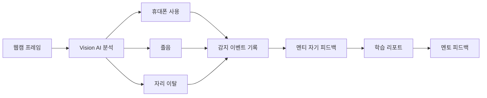
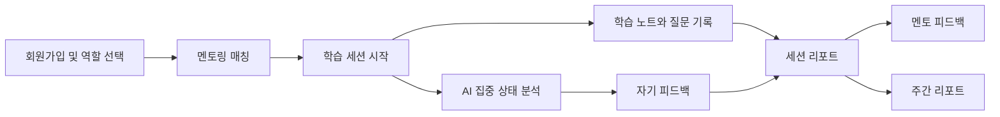
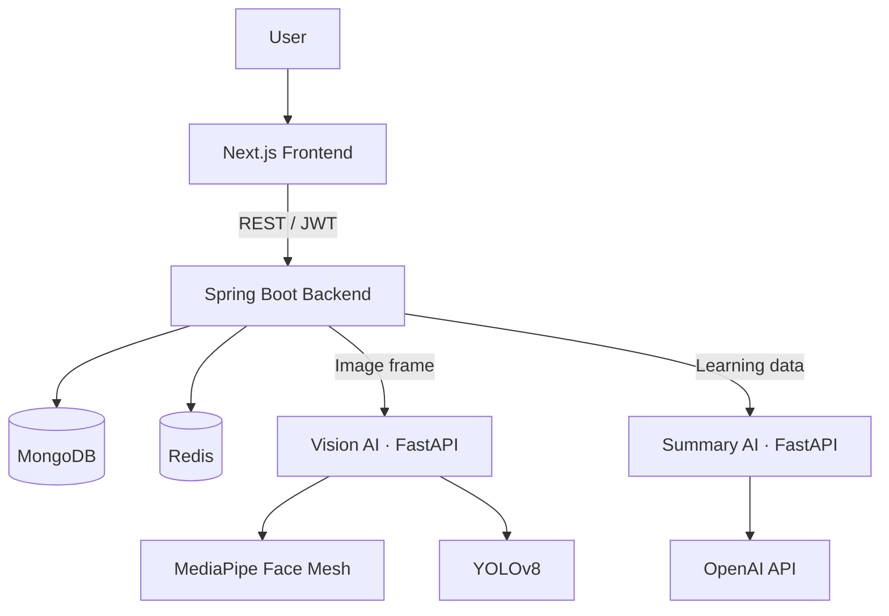

<div align="center">

# AIL-ways

### AI가 학습 흐름을 살피고, 멘토와 멘티의 성장을 연결합니다

웹캠 프레임 기반 집중도 분석과 학습 기록을 결합해<br>
개인화된 리포트와 멘토 피드백을 제공하는 스마트 멘토링 플랫폼입니다.

[](https://openjdk.org/)
[](https://spring.io/projects/spring-boot)
[](https://nextjs.org/)
[](https://react.dev/)
[](https://fastapi.tiangolo.com/)
[](https://www.mongodb.com/)

[서비스 바로가기](https://ail-ways.vercel.app) · [API 문서](#api-문서) · [로컬 실행](#로컬-실행)

</div>

---

## 프로젝트 소개

AIL-ways는 멘토링의 연결부터 학습, 기록, 피드백까지 하나의 흐름으로 관리합니다. 멘티가 학습하는 동안 AI가 졸음·자리 이탈·휴대폰 사용을 분석하고, 세션에서 쌓인 학습 내용과 질문, 집중도 데이터를 리포트로 전환합니다. 멘토는 이 기록을 바탕으로 구체적인 피드백을 남길 수 있습니다.

## AI 행동 감지

> 웹캠 프레임을 실시간으로 분석해 학습을 방해하는 행동을 감지하고, 단순 경고에서 끝나지 않도록 피드백과 리포트에 연결합니다.

| 📱 휴대폰 사용 | 😴 졸음 | 🚶 자리 이탈 |
| :---: | :---: | :---: |
| **YOLOv8 객체 탐지** | **MediaPipe + EAR 분석** | **얼굴 인식 상태 분석** |
| 연속 프레임에서 휴대폰이 확인되면 사용 상태로 판정 | 눈의 랜드마크 비율과 연속 프레임을 바탕으로 졸음 판정 | 일정 프레임 동안 얼굴이 확인되지 않으면 자리 이탈로 판정 |



- 프레임은 학습 화면에서 주기적으로 캡처되어 Vision AI 서버로 전달됩니다.
- 단일 프레임이 아닌 **연속 감지 횟수**를 기준으로 최종 행동을 판정합니다.
- 감지 이벤트에는 행동 유형과 발생 시점이 기록되며, 학습 재개 전 자기 피드백을 작성할 수 있습니다.

## 핵심 기능

| 기능 | 설명 |
| --- | --- |
| 인증 및 프로필 | 이메일 인증 기반 회원가입·로그인, Kakao OAuth, JWT 재발급·로그아웃, 멘토/멘티 역할 및 관심 분야 설정 |
| 멘토링 매칭 | 멘티의 매칭 요청과 멘토의 수락·거절, 현재 멘토/멘티 관계 조회 |
| AI 학습 세션 | 웹캠 프레임을 분석해 졸음, 자리 이탈, 휴대폰 사용을 감지하고 세션별 이벤트로 기록 |
| 학습 기록 | 세션 진행 중 학습 노트와 질문을 기록하고, 감지 이벤트 발생 시 자기 피드백 작성 |
| Q&A 보드 | 매칭된 멘토와 멘티가 게시글·댓글·대댓글로 질의응답하고 해결 상태 관리 |
| 학습 리포트 | 세션별 학습 기록과 AI 요약을 조회하고 멘토가 최종 피드백 작성 |
| 주간 리포트 | 매칭별 주간 데이터를 집계해 집중도와 학습 흐름을 요약 |

## 서비스 흐름



## 시스템 구조



- **Frontend**는 화면 구성, 웹캠 캡처, 서버 액션과 API 프록시를 담당합니다.
- **Backend**는 인증·인가, 매칭, 세션, Q&A, 리포트 등 핵심 비즈니스 로직을 처리합니다.
- **Vision AI**는 얼굴 랜드마크와 객체 탐지를 이용해 프레임 단위 집중 상태를 분석합니다.
- **Summary AI**는 학습 기록을 요약해 세션 및 주간 리포트 생성을 지원합니다.
- **MongoDB**에는 서비스 데이터를, **Redis**에는 refresh token을 저장합니다.

## 기술 스택

| 영역 | 기술 |
| --- | --- |
| Frontend | Next.js 15.4.3, React 19.1, TypeScript 5, Tailwind CSS 4, Framer Motion |
| Backend | Java 21, Spring Boot 3.5.5, Spring Security, Spring Data MongoDB, Spring Data Redis, Gradle |
| Authentication | JWT, Kakao OAuth 2.0, BCrypt |
| AI | Python, FastAPI, OpenCV, MediaPipe, YOLOv8, OpenAI API |
| API Docs | springdoc-openapi, Swagger UI |
| Database | MongoDB, Redis |
| Deployment | Vercel |

## 저장소 구조

```text
AIL-ways/
├── apps/
│   ├── frontend/                 # Next.js 웹 애플리케이션
│   │   ├── public/               # 이미지와 약관 문서
│   │   └── src/app/              # App Router 페이지, API route, server action
│   ├── backend/                  # Spring Boot API 서버
│   │   ├── src/main/java/        # 도메인별 controller/service/repository
│   │   ├── src/main/resources/   # 애플리케이션 설정
│   │   └── src/test/             # 단위·통합 테스트
│   └── ai/                       # Vision 및 리포트 요약 FastAPI 서버
└── README.md
```

Backend는 기능 단위 패키지(`auth`, `user`, `match`, `board`, `session`, `report`)로 나뉘며, 각 패키지는 역할에 따라 `controller`, `service`, `repository`, `domain`, `dto` 계층을 갖습니다.

## 로컬 실행

### 1. 사전 준비

- Java 21
- Node.js 18 이상 및 npm
- Python 3.11 권장
- MongoDB
- Redis

macOS에서는 Homebrew로 MongoDB와 Redis를 준비할 수 있습니다.

```bash
brew tap mongodb/brew
brew install mongodb-community redis
brew services start mongodb-community
brew services start redis
```

### 2. Backend

Backend 실행에 필요한 환경 변수를 설정합니다. 실제 비밀 값은 저장소에 커밋하지 마세요.

```bash
export MONGO_DB_URI="mongodb://localhost:27017/ailways"
export JWT_PW="충분히-긴-JWT-secret"
export APP_PW="Gmail-app-password"
export KAKAO_PW="Kakao-client-id"
export OPENAI_API_KEY="OpenAI-api-key"

cd apps/backend
./gradlew bootRun
```

Backend는 기본적으로 `http://localhost:8080`에서 실행됩니다.

로컬 AI 서버를 연결하려면 Backend 실행 전에 다음 값을 추가로 지정합니다.

```bash
export AI_VISION_BASE_URL="http://localhost:8000"
export AI_API_URL="http://localhost:8001"
export AI_WEEKLY_API_URL="http://localhost:8001"
```

### 3. Frontend

```bash
cd apps/frontend
cp .env.example .env.local
npm install
npm run dev
```

로컬 Backend를 사용할 때는 `.env.local`을 다음과 같이 설정합니다.

```dotenv
BE_URL=http://localhost:8080
NEXT_PUBLIC_API_BASE=http://localhost:8080
```

Frontend는 `http://localhost:3000`에서 확인할 수 있습니다.

### 4. AI 서비스

```bash
cd apps/ai
python3 -m venv venv
source venv/bin/activate
pip install -r requirements.txt
```

Vision AI 서버와 요약 서버는 각각 별도의 터미널에서 실행합니다.

```bash
# Vision AI · port 8000
uvicorn server:app --reload --port 8000

# Summary AI · port 8001
uvicorn summarizer_api:app --reload --port 8001
```

요약 서버를 실행하려면 `apps/ai/.env`에 API 키가 필요합니다.

```dotenv
OPENAI_API_KEY=your-api-key
```

> 처음 Vision AI 서버를 실행할 때 YOLO 모델 가중치가 내려받아질 수 있습니다.

## API 문서

Backend 실행 후 Swagger UI에서 전체 요청·응답 스키마를 확인하고 API를 직접 호출할 수 있습니다.

- Swagger UI: <http://localhost:8080/swagger-ui/index.html>
- OpenAPI JSON: <http://localhost:8080/v3/api-docs>
- Vision AI Docs: <http://localhost:8000/docs>
- Summary AI Docs: <http://localhost:8001/docs>

주요 API 그룹은 다음과 같습니다.

| 그룹 | Base path | 주요 역할 |
| --- | --- | --- |
| Auth | `/api/auth` | 이메일 인증, 회원가입, 로그인, token 재발급, Kakao 연동, 로그아웃 |
| User | `/api/users` | 내 정보 및 프로필 관리 |
| Match | `/api/matches` | 매칭 요청, 수락·거절, 멘토·멘티 조회 |
| Board | `/api/boards` | Q&A 게시글과 댓글 관리 |
| Session | `/api/sessions` | 학습 시작·종료, 딴짓 분석, 학습·질문 로그 |
| Report | `/api/reports` | 세션 리포트 조회와 멘토 피드백 |
| Weekly Report | `/api/reports/weekly` | 주간 리포트 조회와 생성 |

JWT가 필요한 API는 먼저 `POST /api/auth/local/login`으로 로그인한 뒤, Swagger UI의 **Authorize**에서 발급받은 access token을 입력해 테스트할 수 있습니다.

## 테스트 및 빌드

```bash
# Backend test
cd apps/backend
./gradlew test

# Frontend production build
cd apps/frontend
npm run build
```

Backend 통합 테스트는 로컬의 `mongodb://localhost:27017/alpha-test` 데이터베이스를 사용합니다.

---

<div align="center">

**학습에 날개를 달다, AIL-ways**

[GitHub Issues](https://github.com/gahyeon1022/AIL-ways/issues)

</div>
